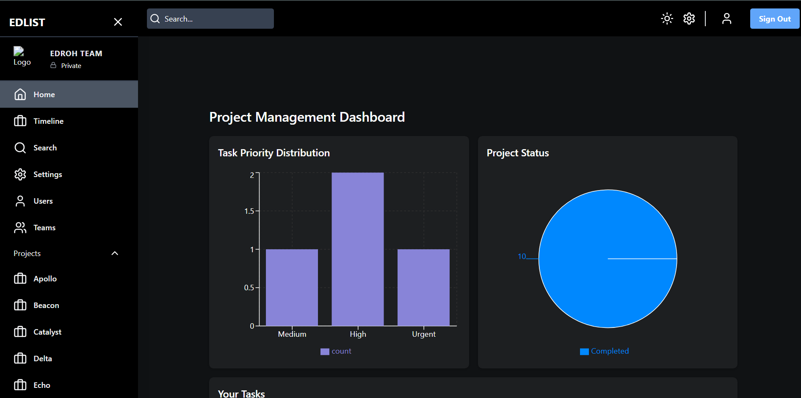
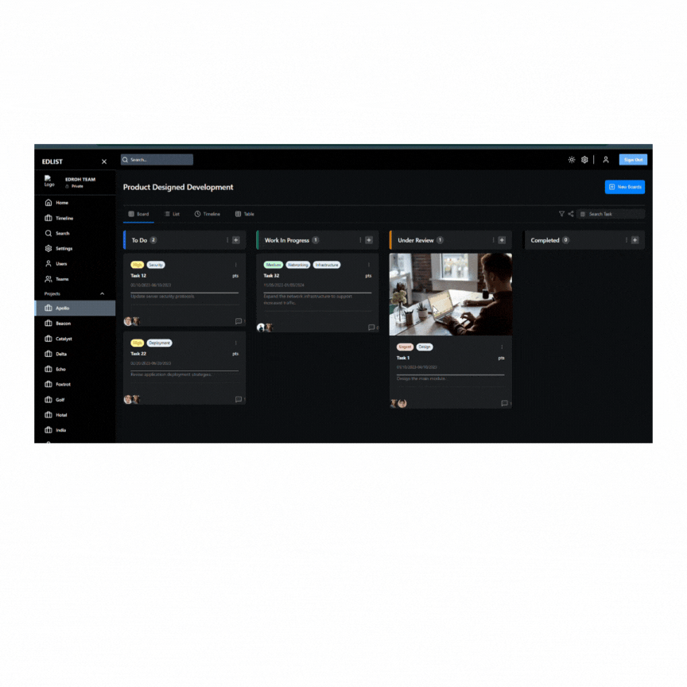
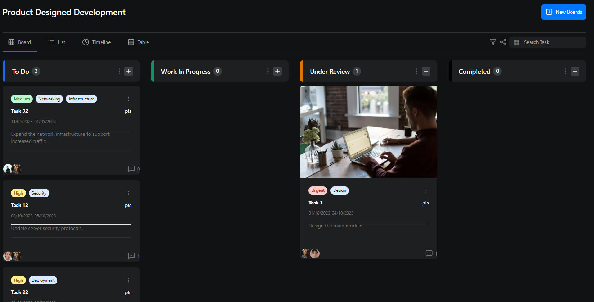
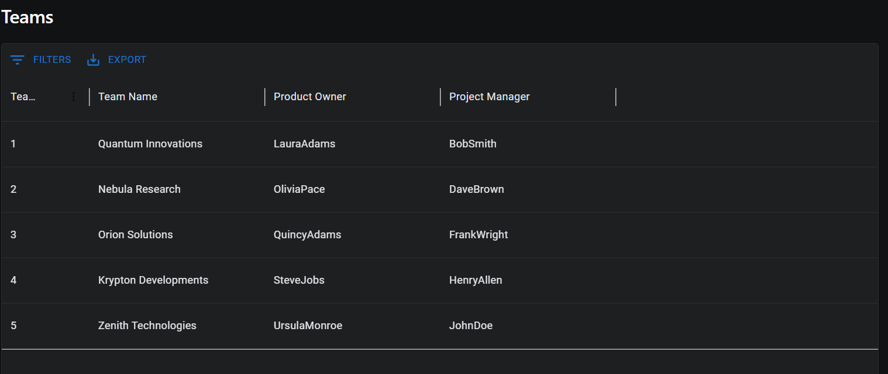
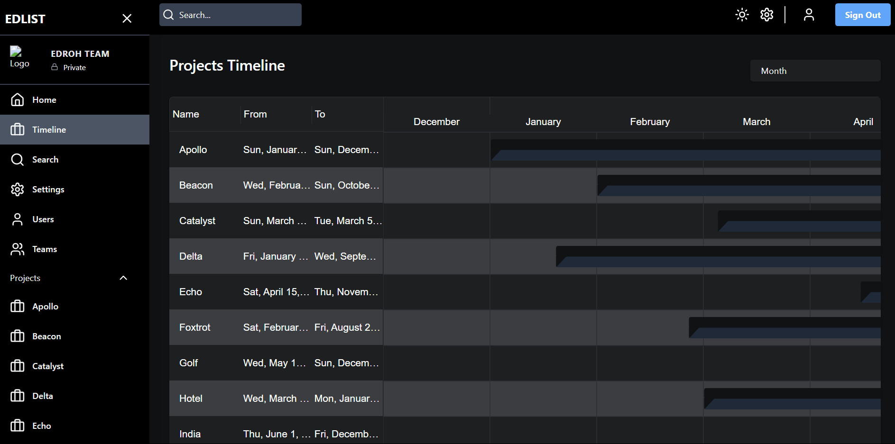
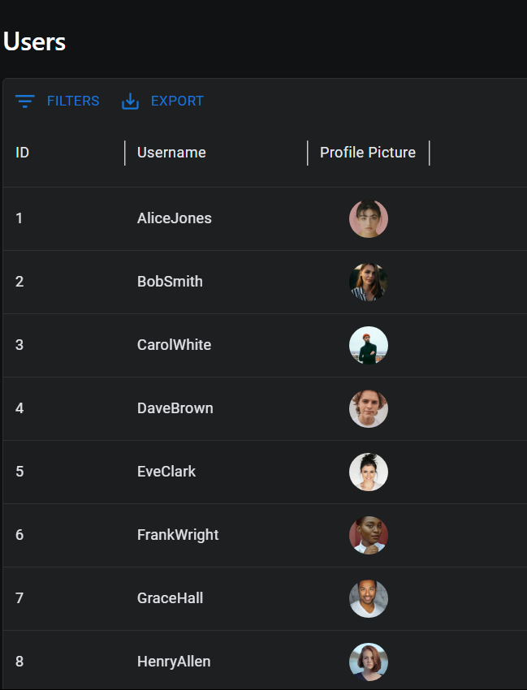

# Project Management App 🗂️
A simple and intuitive Project Management web application to manage tasks, teams, and workflows efficiently.

### 🌐 Live Demo
👉 [View Deployed App](https://master.d1pg7hef1kjhum.amplifyapp.com/)

---

## 🚀 Features
- User Authentication & Authorization
- Create, Edit, Delete Projects
- Drag and Drop functionality for better arrangement of tasks and sorting them on the basis of priority and status
- Task Assignments & Status Tracking
- Team Collaboration Dashboard
- Responsive UI

---

## 🛠️ Tech Stack
- **Frontend:** React.js, TailwindCSS
- **Backend:** Node.js, Express.js
- **Database:** MongoDB
- **Authentication:** JWT, bcrypt

---

## 📸 Screenshots
<!-- Add screenshots/gifs here -->
<!-- Example -->
## 📸 Screenshots

### Dashboard View


### Drag and Drop Feature


### Task Board View



### Team View


### Timeline View


### Users View



---

## 🧑‍💻 Installation & Setup

```bash
# Clone the repository
git clone https://github.com/labhansh0501/project-management-app.git
cd project-management-app

# Install frontend dependencies
cd client
npm install

# Install backend dependencies
cd ../server
npm install

# Add environment variables
# Create a `.env` file in /server with:
# MONGO_URI=your_mongodb_connection
# JWT_SECRET=your_jwt_secret

# Run the development server
npm run dev
```

The app will run on: [http://localhost:3000/](http://localhost:3000/)

---

## 🏗️ Folder Structure
```bash
project-management-app/
│
├── client/      # React Frontend
├── server/      # Express Backend
└── README.md
```

---

## 🧑‍🤝‍🧑 Contributing
Contributions are welcome! Feel free to open issues or submit PRs for improvements and features.

1. Fork the repo
2. Create a new branch (`git checkout -b feature/your-feature`)
3. Commit your changes (`git commit -m 'Add your feature'`)
4. Push to the branch (`git push origin feature/your-feature`)
5. Open a Pull Request

---

## 📄 License
This project is licensed under the MIT License.

---

## 🙋‍♂️ Contact
**Labhansh Bhardwaj** — [LinkedIn](https://www.linkedin.com/in/lakshya-bhardwaj-0568b01a5) | [GitHub](https://github.com/labhansh0501)

---

## ⭐ Give a Star
If you like this project, give it a ⭐️ on [GitHub](https://github.com/labhansh0501/project-management-app)!